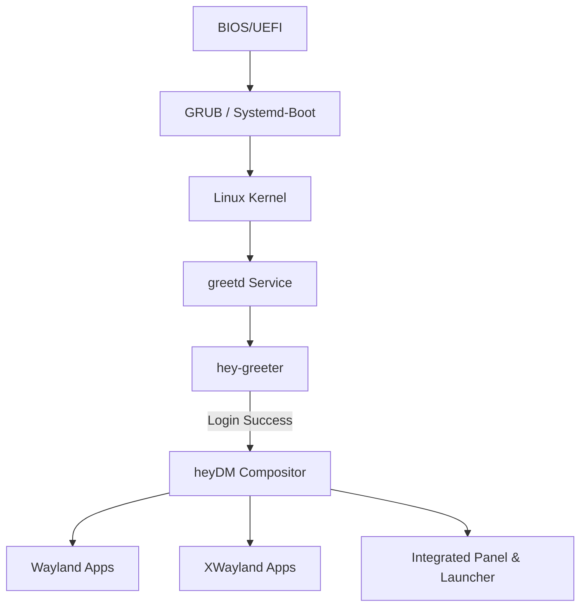

# <p align="center">✨ heyOS ✨</p>

<p align="center">
  
  
  
  
  
</p>

---

**heyOS** is a meticulously crafted, custom Linux distribution built on the robust foundation of **Arch Linux**. It redefines the desktop experience by replacing traditional desktop environments with a bespoke **Wayland stack** written entirely in **Rust**. 

At its core, heyOS is designed for speed, modern aesthetics, and technical transparency. It features a custom compositor, a beautiful login manager, and a streamlined installation process.

---

## 🏗️ Core Architecture

heyOS is built as a modular ecosystem where each component handles a specific part of the user journey:



---

## 💎 Key Components

| Component | Role | Technology Stack | Description |
| :--- | :--- | :--- | :--- |
| **`heydm`** | Display Manager / Compositor | `Rust`, `Smithay`, `Calloop` | A custom Wayland compositor that manages windows, renders a system panel, and provides a built-in application launcher. |
| **`hey-greeter`** | Login Interface | `Rust`, `Slint`, `greetd-ipc` | A visually stunning, modern login screen that handles user authentication via PAM. |
| **`hey-install`** | System Installer | `Bash`, `Arch-Install-Scripts` | An interactive CLI installer that automates disk partitioning, filesystem setup (ext4/btrfs), and system deployment. |
| **`build.sh`** | Build System | `Bash`, `Archiso` | A sophisticated build script that compiles the Rust stack and packages everything into a bootable ISO. |

---

## 🚀 Getting Started

### 1. Build the ISO
To build heyOS, you need an Arch Linux environment. The build script automates everything from dependency resolution to Rust compilation.

```bash
# Clone the repository
git clone https://github.com/darkness-38/heyosx
cd heyosx

# Run the master build script (requires sudo for mkarchiso)
sudo ./build.sh
```

**Advanced Build Features:**
* ⚡ **Native Relocation:** Automatically detects if it's running on a slow mount (like WSL/Windows) and relocates to a native Linux filesystem for 10x faster build speeds.
* 📦 **Incremental Caching:** Intelligent `rsync` and `cargo` cache management ensures that only modified components are rebuilt.
* 🌐 **Offline Caching:** Pre-downloads and caches all installer packages into the ISO for reliable offline installations.
* 🛠️ **Testing Flags:** Use `--greeter-only` or `--heydm-only` to bypass parts of the boot process for rapid UI/Compositor iteration.

### 2. Installation
Once you boot the ISO, you will be greeted by the live environment. To install heyOS to your disk, simply run:

```bash
sudo hey-install
```

The installer will guide you through:
- 🌏 **Localization:** Timezone, Keymap, and Locale selection.
- 💾 **Partitioning:** Automatic GPT/MBR setup with UEFI support.
- 📂 **Filesystems:** Choice between **ext4** or **btrfs** (with subvolume optimization).
- 👤 **User Setup:** Root and primary user creation with appropriate permissions.

---

## 🛠️ Technical Deep Dive

### `heydm` — The Compositor
Built using the [Smithay](https://github.com/Smithay/smithay) framework, `heydm` is more than just a window manager. It implements:
- **Rendering:** Optimized rendering using `glow` (OpenGL) and `pixman` fallbacks.
- **Input:** Seamless handling via `libinput`.
- **Shell:** Support for `xdg-shell` and `layer-shell` protocols.
- **Panel:** A native Rust-rendered panel using `tiny-skia` and `fontdue`.

### `hey-greeter` — The UI
The login screen leverages the **Slint UI** framework to achieve a fluid, hardware-accelerated interface.
- **Integration:** Communicates with `greetd` via JSON-RPC over Unix sockets.
- **Security:** Secure PAM authentication handling.
- **Aesthetics:** Declarative UI design for pixel-perfect layouts.

---

## 📦 Project Structure

```text
.
├── airootfs/            # Filesystem overlay for the Live ISO
│   ├── etc/             # System configurations (greetd, sudoers, etc.)
│   └── usr/local/bin/   # Custom heyOS scripts (hey-install)
├── heydm/               # Custom Wayland Compositor (Rust)
│   ├── src/             # Smithay-based compositor logic
│   └── Cargo.toml
├── heygreeter/          # Login Manager UI (Rust + Slint)
│   ├── ui/              # Slint declarative UI files
│   └── src/             # Greetd IPC and PAM logic
├── build.sh             # Master build orchestration script
├── packages.x86_64      # Core package list for the distribution
└── profiledef.sh        # Archiso profile configuration
```

---

## 🤝 Contributing

We welcome contributions to any part of the stack! 
1. **Compositor:** Help us improve `heydm` window management or protocol support.
2. **UI:** Enhance the `hey-greeter` aesthetics or add new themes.
3. **Installer:** Improve hardware detection or add support for more filesystems.

---

## 📜 License

heyOS is released under the **GPL-3.0 License**. See the `LICENSE` file for more details.

<p align="center">
  Built with ❤️ by the <b>heyOS Project</b>
</p>
