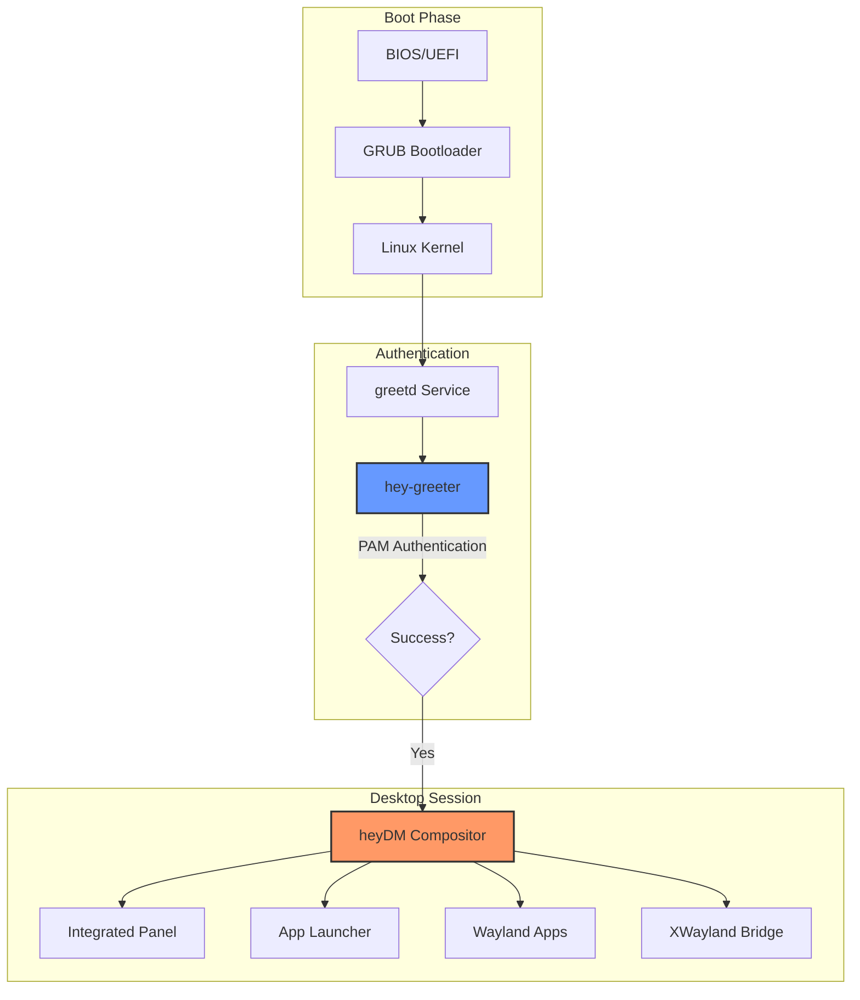

# <p align="center">✨ heyOS ✨</p>

<p align="center">
  
  
  
  
  
</p>

<p align="center">
  <strong>A high-performance, Rust-native Wayland distribution built on Arch Linux.</strong><br>
  <em>Engineered for speed, transparency, and a modern desktop experience.</em>
</p>

---

## 💎 The heyOS Philosophy

**heyOS** isn't just another Arch derivative; it's a fundamental reimagining of the desktop stack. By stripping away legacy X11 dependencies and heavyweight desktop environments, heyOS delivers a pure **Wayland** experience powered by a custom-built **Rust** compositor and UI.

### 🚀 Core Pillars
*   **🦀 Rust First:** From the compositor to the login manager, the core stack is written in safe, high-performance Rust.
*   **⚡ Zero Bloat:** Only the essential protocols (`xdg-shell`, `layer-shell`) are implemented, ensuring a lightning-fast experience.
*   **🎨 Fluid UI:** Hardware-accelerated interfaces using the Slint framework provide 60FPS interactions even on modest hardware.
*   **🛠️ Developer-Centric:** A build system designed for rapid iteration, even when developing inside Windows (WSL2).

---

## 🌟 Project Highlights

| Feature | Description |
| :--- | :--- |
| **`heydm` Compositor** | A bespoke Wayland compositor built on the **Smithay** framework. Handles window management, rendering, and input with high efficiency. |
| **`hey-greeter`** | A modern, hardware-accelerated login interface. Features user auto-discovery, session scanning, and real-time clock integration via **Slint**. |
| **`hey-install`** | An intelligent CLI installer with fuzzy-match autocorrect for localization, automated `GPT/MBR` partitioning, and `Btrfs` optimization. |
| **Turbo Build System** | Automated **WSL/Native relocation** logic that moves the build environment to native Linux filesystems to bypass slow Windows mounts. |
| **Offline Deployment** | Integrated package caching (`pkg-cache`) allows for complete system installation without an active internet connection. |

---

## 🏗️ System Architecture

heyOS is designed as a modular pipeline where each component is decoupled yet perfectly synchronized.



---

## 🛠️ Component Deep Dive

### 🦀 `heydm` — The Engine
The heart of heyOS is `heydm`, a compositor that prioritizes low-latency rendering and protocol stability.
- **Rendering:** Uses the `glow` (OpenGL) backend with automated fallbacks to `pixman` (software rendering).
- **Input:** Native `libinput` integration for smooth touchpad gestures and mouse acceleration.
- **Shell Support:** Full implementation of `xdg-shell` (windows) and `layer-shell` (panels/backgrounds).
- **Architecture:** Built on the `Calloop` event loop for non-blocking I/O and state management.

### 🎨 `hey-greeter` — The Interface
A stunning entry point that bridges the gap between the kernel and the desktop.
- **UI Framework:** Leveraging **Slint** for declarative, compiled UI that runs on the GPU.
- **Logic:** Communicates with `greetd` via JSON-RPC over Unix sockets (`greetd-ipc`).
- **Discovery:** Intelligent scanning of `/etc/passwd` for real users and `/usr/share/wayland-sessions` for available desktops.

### 🧠 `hey-install` — The Deployment
A CLI installer that takes the guesswork out of Arch installation.
- **Fuzzy Autocorrect:** Don't worry about typos; the installer uses fuzzy matching for Timezones, Keymaps, and Locales.
- **Btrfs Optimization:** Automatically creates `@` and `@home` subvolumes with `zstd` compression and `noatime` mount options.
- **Hybrid Boot:** Supports both UEFI (via `efibootmgr`) and Legacy BIOS (via `i386-pc`) configurations.

---

## 🚀 Getting Started

### 1. Prerequisites
- An Arch Linux environment (or WSL2).
- At least 8GB of RAM for ISO generation.
- `sudo` privileges for `mkarchiso` operations.

### 2. The Build Process
Our `build.sh` script is a masterclass in optimization.

```bash
git clone https://github.com/darkness-38/heyosx
cd heyosx

# Run the build (automatically handles dependencies)
sudo ./build.sh
```

**What happens under the hood?**
1. **WSL Detection:** If you're on a Windows mount (`/mnt/c/...`), the script syncs the project to `/var/lib/heyos-build` to avoid NTFS overhead.
2. **Parallel Compilation:** Rust components are compiled in parallel using `cargo`, limited to `nproc/2` to keep your system responsive.
3. **Package Caching:** Only downloads packages once, storing them in `pkg-cache` for future offline builds.
4. **Incremental ISOs:** `mkarchiso` is configured to reuse markers, drastically reducing re-build times.

### 3. Installation
Once booted into the ISO, simply run:
```bash
sudo hey-install
```
Follow the interactive prompts. The installer will guide you through disk selection, filesystem choice, and user creation.

---

## 📦 Project Structure

```text
heyos/
├── airootfs/            # Filesystem overlay (The "Soul" of the ISO)
│   ├── etc/             # Configs for greetd, sudo, locale, and network
│   └── usr/local/bin/   # The intelligent hey-install script
├── heydm/               # Custom Wayland Compositor (Rust/Smithay)
│   ├── src/             # Rendering, input, and window logic
│   └── Cargo.toml       # Dependencies: smithay, calloop, tracing
├── heygreeter/          # Login Manager (Rust/Slint)
│   ├── ui/              # .slint files for the visual design
│   └── src/             # IPC logic and user discovery
├── build.sh             # Master build script (The "Orchestrator")
├── packages.x86_64      # Core package list (Base + UI Stack)
└── profiledef.sh        # Archiso metadata and permission settings
```

---

## 🤝 Contributing

We are actively looking for contributors to help shape the future of **heyOS**!
*   **Window Management:** Help implement tiling or floating window algorithms in `heydm`.
*   **UI/UX:** Design new themes or components for `hey-greeter`.
*   **Tooling:** Extend `hey-install` to support more filesystems (LUKS, LVM).

---

## 📜 License

heyOS is released under the **GPL-3.0 License**. See the `LICENSE` file for more details.

<p align="center">
  Built with ❤️ by the <b>heyOS Project</b>
</p>
