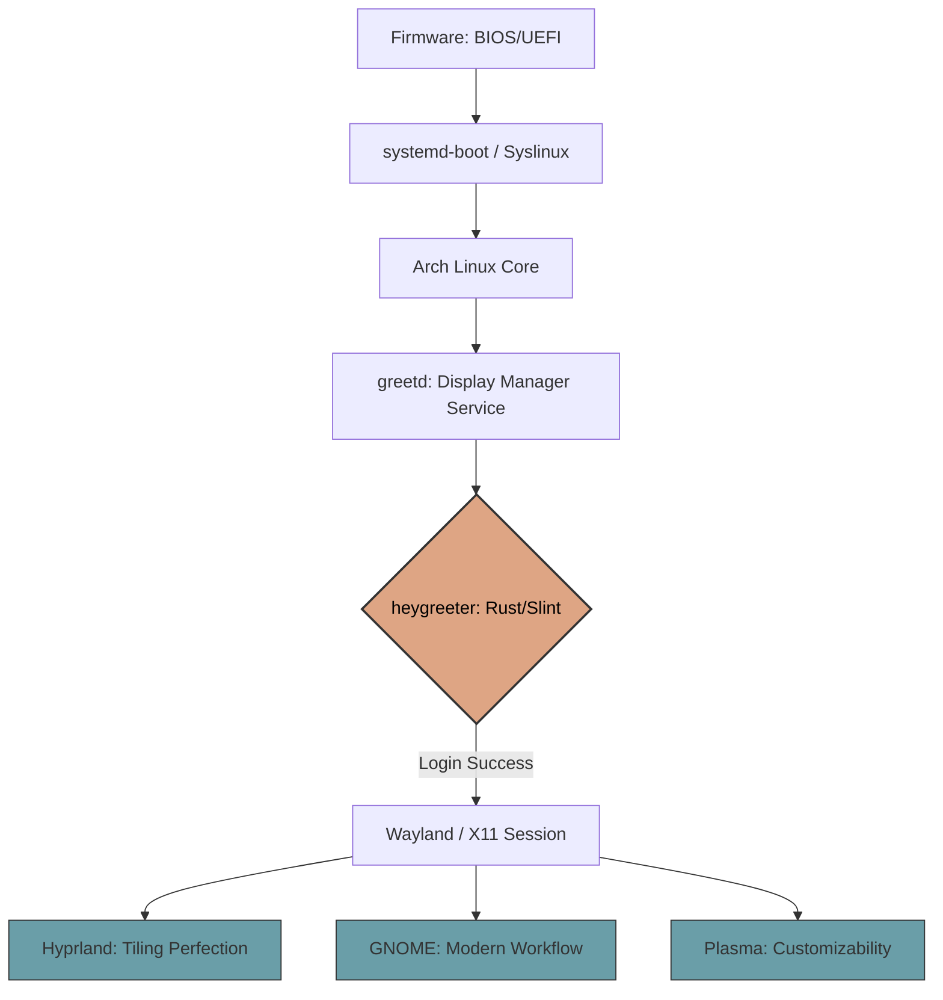

# <p align="center">✨ heyOS ✨</p>

<p align="center">
  
  
  
  
</p>

<p align="center">
  <strong>The definitive Arch-based experience, redefined by Rust.</strong><br>
  A high-fidelity distribution engineered for performance, stability, and breathtaking aesthetics.<br>
  <em>Designed and maintained by the <strong>heyOS Team</strong>.</em>
</p>

---

## 🌌 The Vision

**heyOS** is a meticulously crafted desktop ecosystem designed for users who refuse to compromise between **fluidity**, **modernity**, and **performance**. By leveraging the native speed of **Rust** and the modern design principles of **Slint**, we have forged a system that feels alive and responsive from the very first boot.

### 💎 Design Philosophy
- **Glassmorphism:** Deep translucency, dynamic blur, and high-fidelity gradients.
- **Motion-First:** Every transition is a high-refresh-rate animation.
- **Minimalist Core:** No bloat—only high-performance, purposeful components.

---

## 🚀 Key Features & Innovations

| Component | Technical Excellence |
| :--- | :--- |
| **🎨 heygreeter** | A custom Rust-powered login screen using **Slint**. Features real-time animated backgrounds, hardware-accelerated transitions, and a glassmorphic user selector. |
| **🖼️ Triple Session** | Choose your experience: **GNOME**, **KDE Plasma**, or **Hyprland**. All pre-configured for maximum visual impact. |
| **⚡ Turbo-Build** | An incremental, parallelized ISO build system that syncs directly between WSL2 and native environments. |
| **🧊 Cold Boot** | Optimized boot sequence utilizing **systemd-boot** for lightning-fast cold starts and BIOS/UEFI dual compatibility. |

---

## 🏗️ System Architecture

heyOS follows a modular, secure, and performance-oriented boot flow:


```mermaid
graph TD
    A[Firmware: BIOS/UEFI] --> B[systemd-boot / Syslinux]
    B --> C[Arch Linux Core]
    C --> D[greetd: Display Manager Service]
    D --> E{heygreeter: Rust/Slint}
    E --> |Login Success| F[Wayland / X11 Session]
    F --> G1[Hyprland: Tiling Perfection]
    F --> G2[GNOME: Modern Workflow]
    F --> G3[Plasma: Customizability]
    
    style E fill:#dea584,stroke:#333,stroke-width:2px,color:#000
    style G1 fill:#6a9ea8,stroke:#333,stroke-width:1px
    style G2 fill:#6a9ea8,stroke:#333,stroke-width:1px
    style G3 fill:#6a9ea8,stroke:#333,stroke-width:1px
```

---

## 🛠️ Build & Installation

The heyOS master build script is a powerhouse of automation. It handles parallel crate compilation, package caching, and ISO generation in one command.

### 📋 Prerequisites
- **Arch Linux** (Host or WSL2)
- **mkarchiso**
- **Rustup** (Stable channel)
- **Node.js** (For development tools)

### ⚙️ Build Process
```bash
# Clone the repository
git clone https://github.com/darkness-38/heyosx.git
cd heyosx

# Execute the master build script
# Flags:
# --clean        : Wipes all caches for a pristine rebuild
# --greeter-only : Rapidly compiles and updates just the greeter UI
# --verbose      : Detailed logging for debugging
./build.sh --clean --verbose
```

---

## 💻 Tech Stack Deep Dive

| Layer | Technologies |
| :--- | :--- |
| **Base OS** | [Arch Linux](https://archlinux.org/) (Rolling Release) |
| **UI Engine** | [Slint Framework](https://slint.dev/) (Rust Runtime) |
| **Bootloader** | systemd-boot / Syslinux |
| **Compositors** | Hyprland (Wayland), GNOME (Mutter), Plasma (KWin) |
| **ISO Tooling** | `mkarchiso` + Custom Bash Pipelines |

---

## 🤝 Contributing & Community

We believe in the power of open collaboration. Join the **heyOS Team** in shaping the future of Linux.

1. **Fork** the repository.
2. **Branch** off for your feature: `git checkout -b feature/CoolUI`
3. **Commit** with meaning: `git commit -m 'feat: add acrylic blur to greeter'`
4. **Push** and **Open a Pull Request**.

---

## 📜 License

Distributed under the **MIT License**. We believe in open software for an open world.

<p align="center">
  <br>
  
  <br>
  <em>"Where performance meets poetry."</em> — <strong>heyOS Team</strong>
</p>
