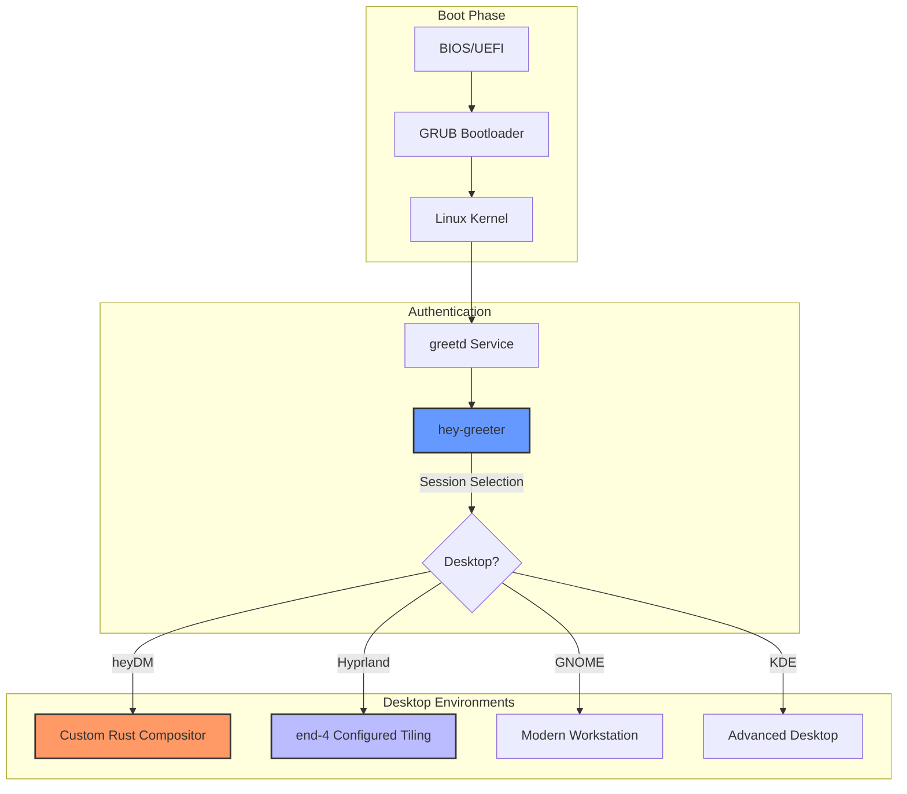

# <p align="center">✨ heyOS ✨</p>

<p align="center">
  
  
  
  
  
</p>

<p align="center">
  <strong>A high-fidelity, multi-DE Wayland distribution engineered for aesthetic perfection.</strong><br>
  <em>Featuring a custom Rust compositor, GNOME, KDE, and pre-configured Hyprland.</em>
</p>

---

## 💎 The heyOS Philosophy

**heyOS** is a performance-first Arch Linux derivative that balances bespoke engineering with a rich, out-of-the-box user experience. While maintaining a core stack written in **Rust**, heyOS now offers a complete suite of modern desktop environments, including a flagship **Hyprland** implementation inspired by the legendary **end-4** aesthetic.

### 🚀 Core Pillars
*   **🦀 Rust-Powered Core:** The `heydm` compositor and `hey-greeter` provide a safe, lightning-fast foundation.
*   **🎭 Multi-DE Hybrid:** Choose between GNOME, KDE Plasma, Hyprland, or heydm directly from the live ISO.
*   **🎨 end-4 Aesthetic:** A fully pre-configured Hyprland environment with professional-grade dotfiles.
*   **✨ Advanced Visuals:** Real-time glassmorphism, living backgrounds, and magnetic focus indicators.

---

## 🌟 Project Highlights

| Feature | Description |
| :--- | :--- |
| **`heydm` Engine** | A Smithay-based compositor with dynamic Master/Stack tiling, 9 workspaces, and fluid sliding transitions. |
| **Hybrid Live ISO** | Boot into a full graphical "heyOS Live" session or a streamlined "heyOS installer" CLI environment. |
| **Integrated UI** | High-fidelity status bar rendered via **tiny-skia** with **fontdue** text rasterization and minimalist system icons. |
| **Magnetic Focus** | A premium animated focus indicator with a soft purple bloom effect that follows the focused window. |
| **`hey-install`** | An intelligent installer that deploys the full multi-DE stack and end-4 dotfiles to your target system. |

---

## 🏗️ System Architecture

heyOS orchestrates multiple desktop environments through a unified authentication layer.


```mermaid
graph TD
    subgraph Boot Phase
        A[BIOS/UEFI] --> B[GRUB Bootloader]
        B --> C[Linux Kernel]
    end

    subgraph Authentication
        C --> D[greetd Service]
        D --> E[hey-greeter]
        E -- Session Selection --> F{Desktop?}
    end

    subgraph Desktop Environments
        F -- heyDM --> G[Custom Rust Compositor]
        F -- Hyprland --> H[end-4 Configured Tiling]
        F -- GNOME --> I[Modern Workstation]
        F -- KDE --> J[Advanced Desktop]
    end

    style G fill:#f96,stroke:#333,stroke-width:2px
    style H fill:#bbf,stroke:#333,stroke-width:2px
    style E fill:#69f,stroke:#333,stroke-width:2px
```

---

## 🛠️ Component Deep Dive

### 🦀 `heydm` — The Engine
The bespoke engine of heyOS has evolved into a feature-rich shell:
- **Dynamic Tiling:** Advanced Master/Stack algorithm with configurable gaps and real-time layout toggling.
- **Interactions:** 9 Workspaces with horizontal sliding animations and eased window interpolation.
- **Glassmorphism:** Semi-transparent top bar and side panels with high-contrast borders and a "frosted" aesthetic.
- **Living Background:** Procedurally generated blobs that animate smoothly using brand colors.

### 🎨 The Desktop Suite
- **Hyprland:** Comes pre-loaded with **end-4 dotfiles**, JetBrains Mono Nerd fonts, and all necessary plugins for a "Hyprland Pro" experience.
- **GNOME & KDE:** Full vanilla implementations for users who require a traditional, robust workflow.
- **Unified Greeter:** A hardware-accelerated **Slint** interface that manages user discovery and session switching seamlessly.

---

## ⌨️ heyDM Keyboard Shortcuts

| Keybinding | Action |
| :--- | :--- |
| <kbd>Super</kbd> + <kbd>Enter</kbd> | Open Terminal (`alacritty`) |
| <kbd>Super</kbd> + <kbd>Space</kbd> | Toggle Tiling / Floating Layout |
| <kbd>Super</kbd> + <kbd>1</kbd> - <kbd>9</kbd> | Switch Workspace |
| <kbd>Super</kbd> + <kbd>Shift</kbd> + <kbd>1</kbd> - <kbd>9</kbd> | Move Window to Workspace |
| <kbd>Super</kbd> + <kbd>I</kbd> / <kbd>O</kbd> | Increase / Decrease Master Window Count |
| <kbd>Super</kbd> + <kbd>.</kbd> / <kbd>,</kbd> | Increase / Decrease Master Area Ratio |
| <kbd>Super</kbd> + <kbd>D</kbd> | Toggle Application Launcher |
| <kbd>Super</kbd> + <kbd>Q</kbd> | Close Focused Window |
| <kbd>Super</kbd> + <kbd>Tab</kbd> | Cycle Focus Between Windows |
| <kbd>Super</kbd> + <kbd>Shift</kbd> + <kbd>E</kbd> | Exit heyOS (Logout) |

---

## 🚀 Getting Started

### 1. Prerequisites
- At least 8GB of RAM for ISO generation (due to the large DE package set).
- `sudo` privileges for `mkarchiso` and `pacman` operations.

### 2. The Build Process
The build system now handles cloning external assets and configuring the hybrid boot environment automatically.

```bash
git clone https://github.com/darkness-38/heyosx
cd heyosx

# Run a clean build to ensure all DE assets are correctly synced
sudo ./build.sh --clean
```

### 3. Usage & Installation
- **heyOS Live:** Default boot option. Explore all desktop environments directly from the ISO. (User: `hey`, Pass: `hey`)
- **heyOS installer:** CLI boot option. Run `sudo hey-install` to begin deployment.

---

## 📦 Project Structure

```text
heyos/
├── airootfs/            # Filesystem overlay (The "Soul" of the ISO)
│   ├── etc/skel/        # Skeleton files (Includes end-4 Hyprland dots)
│   └── usr/local/bin/   # Installer and multi-DE launcher scripts
├── heydm/               # Custom Wayland Compositor (Rust + Smithay)
│   └── src/             # Tiling, Workspaces, and Skia/Fontdue rendering
├── heygreeter/          # Login Manager (Rust + Slint)
├── build.sh             # Hybrid ISO Build System
└── packages.x86_64      # Extended package list (GNOME, KDE, Hyprland)
```

---

## 📜 License

heyOS is released under the **GPL-3.0 License**.

<p align="center">
  Built with ❤️ by the <b>heyOS Project</b>
</p>
