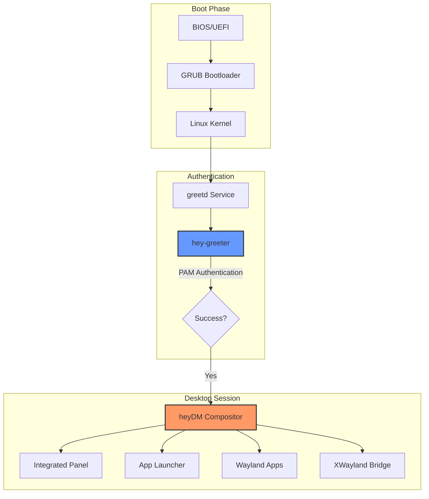

# <p align="center">✨ heyOS ✨</p>

<p align="center">
  
  
  
  
  
</p>

<p align="center">
  <strong>A high-performance, Rust-native Wayland distribution built on Arch Linux.</strong><br>
  <em>Engineered for speed, transparency, and a modern desktop experience.</em>
</p>

---

## 💎 The heyOS Philosophy

**heyOS** isn't just another Arch derivative; it's a fundamental reimagining of the desktop stack. By stripping away legacy X11 dependencies and heavyweight desktop environments, heyOS delivers a pure **Wayland** experience powered by a custom-built **Rust** compositor and UI.

### 🚀 Core Pillars
*   **🦀 Rust First:** From the compositor to the login manager, the core stack is written in safe, high-performance Rust.
*   **⚡ Zero Bloat:** Only the essential protocols (`xdg-shell`, `layer-shell`) are implemented, ensuring a lightning-fast experience.
*   **🎨 Fluid UI:** Hardware-accelerated interfaces using the Slint framework provide 60FPS interactions even on modest hardware.
*   **🛠️ Developer-Centric:** A build system designed for rapid iteration, even when developing inside Windows (WSL2).

---

## 🌟 Project Highlights

| Feature | Description |
| :--- | :--- |
| **`heydm` Compositor** | A bespoke Wayland compositor built on the **Smithay** framework. Handles window management, rendering, and input with high efficiency. |
| **`hey-greeter`** | A modern, hardware-accelerated login interface. Features user auto-discovery, session scanning, and real-time clock integration via **Slint**. |
| **`hey-install`** | An intelligent CLI installer with fuzzy-match autocorrect for localization, automated `GPT/MBR` partitioning, and `Btrfs` optimization. |
| **Turbo Build System** | Automated **WSL/Native relocation** logic that moves the build environment to native Linux filesystems to bypass slow Windows mounts. |
| **Offline Deployment** | Integrated package caching (`pkg-cache`) allows for complete system installation without an active internet connection. |

---

## 🏗️ System Architecture

heyOS is designed as a modular pipeline where each component is decoupled yet perfectly synchronized.


```mermaid
graph TD
    subgraph Boot Phase
        A[BIOS/UEFI] --> B[GRUB Bootloader]
        B --> C[Linux Kernel]
    end

    subgraph Authentication
        C --> D[greetd Service]
        D --> E[hey-greeter]
        E -- PAM Authentication --> F{Success?}
    end

    subgraph Desktop Session
        F -- Yes --> G[heyDM Compositor]
        G --> H[Integrated Panel]
        G --> I[App Launcher]
        G --> J[Wayland Apps]
        G --> K[XWayland Bridge]
    end

    style G fill:#f96,stroke:#333,stroke-width:2px
    style E fill:#69f,stroke:#333,stroke-width:2px
```

---

## 🛠️ Component Deep Dive

### 🦀 `heydm` — The Engine
The heart of heyOS is `heydm`, a compositor that prioritizes low-latency rendering and protocol stability.
- **Rendering:** Dual-backend support using `glow` (OpenGL) for hardware acceleration and `pixman` for software fallback.
- **Input:** Native `libinput` integration for smooth touchpad gestures, mouse acceleration, and precise keyboard routing.
- **Shell Support:** Full implementation of `xdg-shell` (standard windows) and `layer-shell` (panels and backgrounds).
- **Integrated Panel:** A real-time status bar displaying:
    - 🕒 **Clock:** Live localized time and date.
    - 🔋 **Power:** Intelligent battery monitoring with charging indicators and status icons (█, ▓, ▒, ░).
    - 🌐 **Network:** Automatic interface discovery (WiFi/Ethernet) and status reporting.
- **App Launcher:** A Super+D triggered overlay that scans standard XDG paths, parses `.desktop` files, and supports fuzzy searching.

### 🎨 `hey-greeter` — The Interface
A stunning entry point that bridges the gap between the kernel and the desktop.
- **UI Framework:** Built with **Slint**, compiling declarative UI code into highly optimized GPU-accelerated binaries.
- **Logic:** Communicates with `greetd` via JSON-RPC over Unix sockets (`greetd-ipc`).
- **Discovery:** Scans `/etc/passwd` for valid users and `/usr/share/wayland-sessions` to present available desktop environments.

### 🧠 `hey-install` — The Deployment
A CLI installer that takes the guesswork out of Arch installation.
- **Fuzzy Autocorrect:** Intelligent matching for Timezones, Keymaps, and Locales to prevent installation failures due to typos.
- **Btrfs Optimization:** Automatically configures `@` and `@home` subvolumes with `zstd` compression, `noatime`, and optimized commit intervals.
- **Hybrid Boot:** Supports both UEFI (via `efibootmgr`) and Legacy BIOS configurations.
- **Zero-Touch Mirroring:** Automatically selects the 5 fastest HTTPS mirrors via `reflector`.

---

## ⌨️ Keyboard Shortcuts

heyOS uses a simple, modern set of keybindings for high-speed navigation.

| Keybinding | Action |
| :--- | :--- |
| <kbd>Super</kbd> + <kbd>Enter</kbd> | Open Terminal (`alacritty`) |
| <kbd>Super</kbd> + <kbd>D</kbd> | Toggle Application Launcher |
| <kbd>Super</kbd> + <kbd>Q</kbd> | Close Focused Window |
| <kbd>Alt</kbd> + <kbd>F4</kbd> | Close Focused Window |
| <kbd>Super</kbd> + <kbd>F</kbd> | Toggle Fullscreen |
| <kbd>Super</kbd> + <kbd>Left</kbd> | Tile Window Left |
| <kbd>Super</kbd> + <kbd>Right</kbd> | Tile Window Right |
| <kbd>Super</kbd> + <kbd>Tab</kbd> | Cycle Focus Between Windows |
| <kbd>Super</kbd> + <kbd>Shift</kbd> + <kbd>E</kbd> | Exit heyOS (Logout) |

---

## 🚀 Getting Started

### 1. Prerequisites
- An Arch Linux environment (or WSL2).
- At least 8GB of RAM for ISO generation.
- `sudo` privileges for `mkarchiso` operations.

### 2. The Build Process
Our `build.sh` script is a masterclass in optimization.

```bash
git clone https://github.com/darkness-38/heyosx
cd heyosx

# Run the build (automatically handles dependencies)
sudo ./build.sh
```

**Under the Hood:**
1. **WSL Relocation:** If running in WSL, the script detects NTFS mounts and syncs the project to `/var/lib/heyos-build` to bypass Windows filesystem overhead.
2. **Parallel Compilation:** Rust components are compiled in parallel, utilizing `nproc/2` to maximize throughput while keeping the host system responsive.
3. **Package Caching:** Downloads packages once into `pkg-cache`, enabling rapid, offline-capable re-builds.
4. **Surgical Cleanup:** Reuses `mkarchiso` work markers to avoid redundant package installations.

### 3. Installation
Once booted into the ISO, simply run:
```bash
sudo hey-install
```
The installer will guide you through disk selection, filesystem choice, and user creation with interactive, fuzzy-matched prompts.

---

## 📦 Project Structure

```text
heyos/
├── airootfs/            # Filesystem overlay (The "Soul" of the ISO)
│   ├── etc/             # Configs for greetd, sudo, locale, and network
│   └── usr/local/bin/   # Scripts: hey-install, greeter-launch
├── heydm/               # Custom Wayland Compositor (Rust + Smithay)
│   ├── src/             # Rendering, input, panel, and launcher logic
│   └── Cargo.toml       # Deps: smithay, calloop, fontdue, tiny-skia
├── heygreeter/          # Login Manager (Rust + Slint)
│   ├── ui/              # .slint files for the visual design
│   └── src/             # IPC logic, PAM auth, and user discovery
├── build.sh             # Master build script (The "Orchestrator")
├── packages.x86_64      # Core package list (Base + UI Stack)
└── profiledef.sh        # Archiso metadata and permission settings
```

---

## 🤝 Contributing

We are building the future of the Rust desktop! We welcome contributions in:
*   **Window Management:** Implementing advanced tiling algorithms (master/stack, spiral).
*   **UI/UX:** Enhancing the Slint-based greeter or the `heydm` panel aesthetics.
*   **Tooling:** Adding LUKS/LVM support to `hey-install`.

---

## 📜 License

heyOS is released under the **GPL-3.0 License**. See the `LICENSE` file for more details.

<p align="center">
  Built with ❤️ by the <b>heyOS Project</b>
</p>
